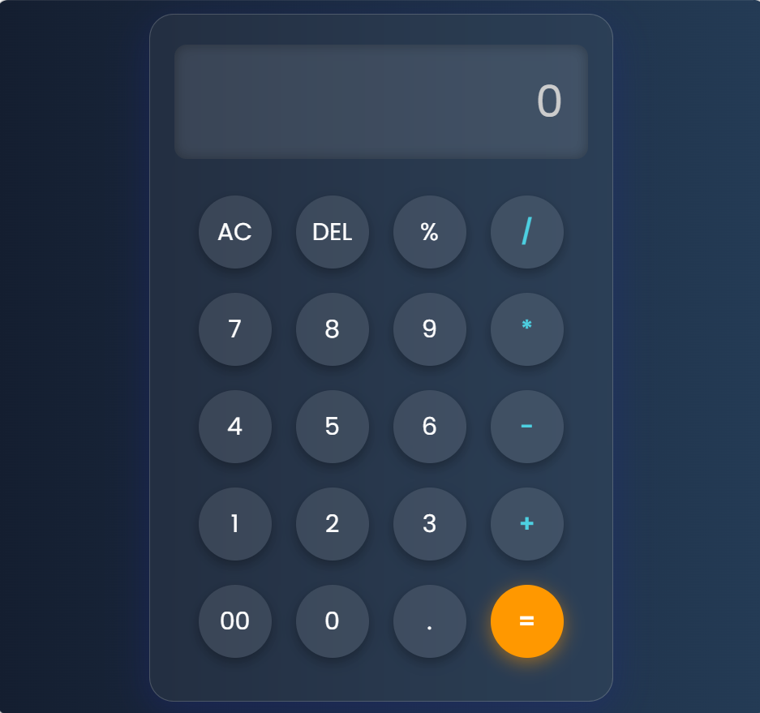

# Calculator

A sleek and minimalist calculator application featuring a tactile "soft UI" aesthetic. This project demonstrates advanced CSS styling techniques and vanilla JavaScript logic to create a functional, modern tool for daily calculations.

## ✨ Features

- **Neumorphic Design:**
  Advanced use of CSS box-shadow and gradients to create a realistic, 3D pushed-button effect.
- **Complete Arithmetic:**
  Handles all basic operations including addition, subtraction, multiplication, and division.
- **Precision Controls:**
  Includes a decimal point, double-zero (00) for financial entries, and a percentage (%) function.
- **Responsive & Clean:**
  A vertically centered, mobile-friendly interface designed for clarity and ease of use.

## 🖼️ Preview



## 🛠️ Built With

* **HTML5:** Semantic structure for the calculator body and display.
* **CSS3:** Custom properties and neomorphism styling.
* **JavaScript:** Vanilla JS for mathematical logic and DOM manipulation.

## 📂 Project Structure

```
calculator
│
├── index.html
├── style.css
├── script.js
├── assets
└── README.md
```

## 🚀 How to Run

1. Clone the repository

```
git clone https://github.com/muhammad-anas-15/Calculator-UI.git
```

2. Open **index.html** in your browser.

⭐ If you like this project, feel free to star the repository.
